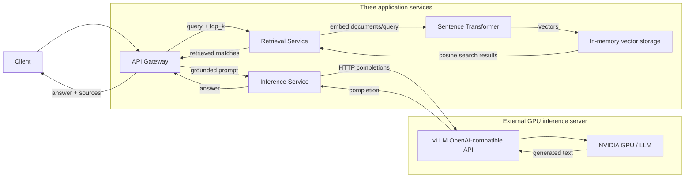

# Distributed RAG Inference Platform

A distributed RAG system built with Python and FastAPI, combining semantic retrieval with GPU-backed LLM generation through vLLM. Three independently deployable application services separate request orchestration, retrieval, and inference. Docker Compose supports local deployment; Kubernetes manifests support Google Kubernetes Engine (GKE).

Validated with Qwen2.5-1.5B-Instruct served by vLLM on an external NVIDIA A40. The application services run independently of the GPU/model server.

## Architecture



The gateway constructs numbered source context and a grounded prompt. Inference forwards the prompt to vLLM; the gateway never communicates directly with the model server.

## Key Features

- Three independently deployable FastAPI services with async HTTP communication, reusable clients, timeouts, and safe upstream error handling.
- Document ingestion with overlapping chunks, batch Sentence Transformer embeddings, and in-memory chunk storage.
- Hand-implemented cosine similarity and top-K semantic search preserving document IDs, retrieved text, and similarity scores.
- Grounded RAG prompts instructing the model to use only supplied context and acknowledge insufficient information.
- OpenAI-compatible vLLM adapter for configurable, non-streaming generation.
- Multi-stage Docker builds and Docker Compose service networking.
- Kubernetes Service DNS, health probes, resource controls, and non-root security contexts.
- GKE deployment validation and live ingestion/retrieval checks.
- Automated unit and integration tests with mocked external dependencies.

## GPU Inference Benchmark

**These are direct vLLM inference-serving benchmarks, not end-to-end RAG throughput.** Retrieval, gateway orchestration, and context construction are outside these measurements.

| Concurrency | Requests | p50 latency | p95 latency | Requests/sec | Output tokens/sec |
| --- | --- | --- | --- | --- | --- |
| 1 | 5 | 0.799 s | 0.803 s | 1.25 | 125.44 |
| 5 | 25 | 0.907 s | 0.918 s | 5.52 | 592.08 |
| 10 | 50 | 0.920 s | 0.934 s | 10.76 | 1105.65 |
| 20 | 100 | 0.949 s | 1.052 s | 20.31 | 2007.1 |

Benchmark environment: NVIDIA A40 48 GB; `Qwen/Qwen2.5-1.5B-Instruct`; vLLM 0.10.2; PyTorch 2.8.0+cu128; model max sequence length 4096. The concurrency-20 run completed **100/100 requests successfully**. During telemetry capture, peak observed GPU utilization was **90%**, and peak observed VRAM usage was **42,046 MiB**.

Measurements and deployment outcomes summarize validation runs reported by the project author.

## Deployment Validation

- Docker Compose successfully ran all three application services.
- Gateway, retrieval, and inference were deployed to GKE and reached Ready state.
- Kubernetes internal Service DNS/networking, live document ingestion, and semantic retrieval were validated on GKE.
- The GKE cluster was deleted after validation.
- The complete RAG request path was separately validated against Qwen2.5-1.5B-Instruct served by vLLM on an NVIDIA A40.

The NVIDIA GPU/vLLM server was external to the GKE application deployment.

## Quick Start

Requires Python 3.11+ and uv. Run from the repository root:

```powershell
uv sync --locked
```

Create your own `.env` file in the repository root using the environment variables documented below. Configure the external vLLM endpoint and exact served model name. Start each service in a separate terminal:

```powershell
uv run --locked uvicorn api_gateway.main:app --host 127.0.0.1 --port 8000 --reload
uv run --locked --package distributed-rag-retrieval uvicorn retrieval_service.main:app --host 127.0.0.1 --port 8001 --reload
uv run --locked --package distributed-rag-inference-service uvicorn inference_service.main:app --host 127.0.0.1 --port 8002 --reload
```

Ingest documents through retrieval before querying the gateway. Interactive docs are at `/docs` on each service.

Environment variables override `.env`, loaded relative to the working directory:

| Variable | Local default / purpose |
| --- | --- |
| `RAG_RETRIEVAL_SERVICE_URL` | `http://127.0.0.1:8001` |
| `RAG_INFERENCE_SERVICE_URL` | `http://127.0.0.1:8002` |
| `RAG_RETRIEVAL_TIMEOUT_SECONDS` | `10` |
| `RAG_INFERENCE_TIMEOUT_SECONDS` | `90` |
| `RETRIEVAL_EMBEDDING_MODEL` | `sentence-transformers/all-MiniLM-L6-v2` |
| `INFERENCE_VLLM_BASE_URL` | `http://127.0.0.1:8003/v1/`; configure for your server |
| `INFERENCE_VLLM_MODEL` | `your-served-model`; replace with the exact served name |
| `INFERENCE_VLLM_TIMEOUT_SECONDS` | `60` |
| `INFERENCE_VLLM_API_KEY` | Optional external-server bearer token |

App names and environment labels use the existing `RAG_`, `RETRIEVAL_`, and `INFERENCE_` prefixes. Keep your environment files and secrets out of version control.

## API

| Service | Endpoint | Request → response |
| --- | --- | --- |
| All | `GET /health` | `{"status":"ok"}`; process liveness |
| Gateway | `POST /v1/query` | `query`, `top_k`, `max_tokens`, `temperature` → `status`, generated `answer`, `sources` |
| Retrieval | `POST /v1/documents` | `text`, optional `title` → `document_id`, `chunk_count` |
| Retrieval | `POST /v1/retrieve` | `query`, `top_k` → `matches` with `document_id`, `text`, `score` |
| Inference | `POST /v1/generate` | `prompt`, `max_tokens`, `temperature` → `answer`, `model`, `finish_reason` |

`top_k` defaults to 5 (1–100), `max_tokens` to 256 (1–8192), and `temperature` to 0.2 (0–2). Queries accept 1–10,000 characters after trimming; ingestion text accepts 1–1,000,000. Ingestion uses 500-character chunks with a 50-character overlap; optional titles are accepted but not stored.

Invalid requests return 422. HTTP upstream failures return 502 and timeouts return 504. Health checks do not assert external vLLM or embedding readiness.

Example gateway response:

```json
{
  "status": "completed",
  "answer": "The generated answer.",
  "sources": [{"document_id": "document-id", "text": "Retrieved context.", "score": 0.9}]
}
```

## Docker

Use Docker with Linux containers and Compose v2. Configure `.env` first. For vLLM on the Docker host, set `INFERENCE_VLLM_BASE_URL=http://host.docker.internal:8003/v1/`; for a remote server, use its reachable hostname.

```powershell
docker compose up --build -d --wait
docker compose ps
docker compose logs -f
# Stop the application services.
docker compose down
```

Compose runs `gateway`, `retrieval`, and `inference` on one network. All containers listen on port 8000 internally. Gateway uses `http://retrieval:8000` and `http://inference:8000`; inference calls external vLLM. Host ports 8000, 8001, and 8002 bind to loopback.

Dockerfiles install service-specific runtime dependencies from `uv.lock`, run as non-root, and include healthchecks. No vLLM server or model weights are included. The first embedding call downloads weights unless cached. After environment changes, recreate containers with `docker compose up -d --force-recreate --wait`.

## Kubernetes / GKE

The validated GKE deployment used images from Google Artifact Registry:

| Deployment / Service | Image |
| --- | --- |
| `api-gateway` | `us-east1-docker.pkg.dev/distributed-rag-inference/rag-platform/gateway:latest` |
| `retrieval` | `us-east1-docker.pkg.dev/distributed-rag-inference/rag-platform/retrieval:latest` |
| `inference` | `us-east1-docker.pkg.dev/distributed-rag-inference/rag-platform/inference:latest` |

The [k8s/](k8s/) manifests reference these images with `IfNotPresent`. Use a running cluster, a configured kubectl context, and nodes authorized to pull the images. Set the external vLLM URL/model in [k8s/configmap.yaml](k8s/configmap.yaml); its default hostname is a placeholder. Kubernetes does not load the local `.env`.

```powershell
kubectl apply --dry-run=client -f k8s/
kubectl apply -f k8s/
kubectl rollout status deployment/api-gateway
kubectl rollout status deployment/retrieval
kubectl rollout status deployment/inference
kubectl get pods,services
kubectl port-forward service/api-gateway 8000:8000
```

Open `http://127.0.0.1:8000/docs`. For ingestion, forward retrieval separately: `kubectl port-forward service/retrieval 8001:8000`.

ClusterIP Services expose port 8000 in the current namespace. Gateway uses `retrieval:8000` and `inference:8000` through Service DNS. Deployments include startup/readiness/liveness probes, CPU/memory controls, non-root users, dropped capabilities, and read-only root filesystems with writable temporary storage.

For authenticated vLLM, provide a Secret named `vllm-credentials` with key `api-key` in the same namespace; only inference references it. After configuration changes, use `kubectl rollout restart deployment/api-gateway deployment/retrieval deployment/inference`. The original validation cluster no longer exists; these instructions target a new or existing cluster.

## Testing

**154 automated tests passed; 0 failed.** Tests cover validation, chunking, cosine similarity, ranking, ingestion/storage, prompt construction, HTTP error handling, and the gateway-to-inference request path.

```powershell
uv run --locked pytest
```

External HTTP/model dependencies are mocked where appropriate. Tests do not require a GPU or running vLLM server; live GPU measurements are reported separately above.

## Design Decisions / Limitations

- Retrieval storage is process-local/in-memory. A single replica and worker are used because state is not shared; documents are lost on restart.
- No persistent vector database is used. Retrieval performs cosine scoring over stored chunks.
- vLLM is an external inference dependency, not a Kubernetes workload in this repository.
- The retrieval Docker image is relatively large because of PyTorch and Sentence Transformer dependencies.
- Generation is non-streaming, and token limits must fit the external model's context window.
- End-to-end RAG load testing remains future work; direct vLLM throughput does not measure the full pipeline.

## Future Work

Persistent vector storage; shared retrieval state; Kubernetes autoscaling; multi-GPU inference; end-to-end RAG load testing; and observability/metrics.
